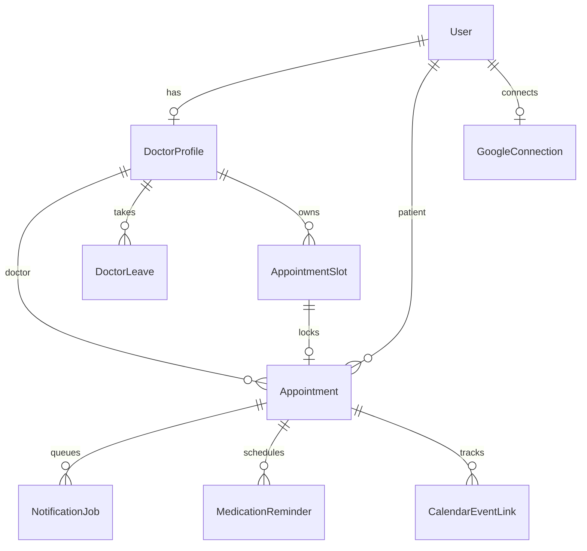

# CareSync

Healthcare Appointment & Follow-up Manager

CareSync is a complete role-based healthcare appointment platform for patients, doctors, and clinic administrators. It implements safe slot holds, appointment booking and rescheduling, doctor leave conflicts, AI-assisted summaries, medication reminders, retryable email delivery, and per-user Google Calendar sync.

> CareSync is a coordination tool, not an emergency or diagnostic service. The pre-visit summary is a drafting aid and should be reviewed by a clinician.

## Included workflows

- Patient registration and signed HTTP-only cookie authentication
- Role authorization for patient, doctor, and admin APIs
- Doctor search by name, qualification, and specialty
- Live availability based on weekly hours, leave, slot duration, bookings, and active holds
- Five-minute slot holds with database-level double-booking prevention
- Appointment booking, cancellation, and transactional rescheduling
- Pre-visit symptom summary with Low/Medium/High urgency
- Doctor clinical notes, prescription, and patient-friendly post-visit summary
- Medication reminders derived from frequency and duration
- Branded, responsive transactional email with plain-text fallbacks
- Per-user notification activity, delivery testing, and manual retry controls
- Transactional email and Google Calendar outbox with retry/backoff
- Automatic notification worker included in Docker Compose
- Admin doctor profiles, working hours, and conflict-aware leave scheduling
- Responsive, accessible patient, doctor, and admin portals
- Docker and Vercel deployment configuration

## Technology

- Next.js 15, React 19, TypeScript
- Prisma ORM and PostgreSQL
- Zod validation, bcrypt password hashing, JOSE signed sessions
- Nodemailer SMTP, Google Calendar REST API with OAuth 2.0
- Groq Chat Completions API with deterministic fallbacks
- Vitest

## Quick start

Requirements: Node.js 20+, pnpm 11+, and PostgreSQL 16+.

```bash
cp .env.example .env
pnpm install
pnpm db:setup
pnpm dev
```

Open [http://localhost:3000](http://localhost:3000).

### Run with Docker

Add your secrets to `.env`, then run:

```bash
docker compose up --build
```

The Compose configuration exposes port 3000 and stores PostgreSQL data in the persistent `caresync-postgres-data` volume. `GROQ_API_KEY` is passed at runtime through `.env`; it is excluded from the Docker build context.

Demo accounts (all use password `Demo@123`):

| Role | Email |
|---|---|
| Patient | `patient@caresync.dev` |
| Doctor | `prachi639220+doctor@gmail.com` |
| Admin | `prachi639220@gmail.com` |

The seed is idempotent. It creates two doctors, a future appointment, and a completed appointment with a follow-up summary.

## Environment variables

Copy `.env.example`; never commit real secrets.

| Variable | Required | Purpose |
|---|---:|---|
| `DATABASE_URL` | Yes | Pooled PostgreSQL connection URL |
| `AUTH_SECRET` | Yes | Random secret (32+ characters) for signed sessions |
| `APP_URL` | Yes | Public application origin |
| `CRON_SECRET` | Production | Protects `/api/cron/process` |
| `GROQ_API_KEY` | No | Enables Groq summaries; fallback works without it |
| `GROQ_MODEL` | No | Defaults to `openai/gpt-oss-20b` |
| `GROQ_BASE_URL` | No | Defaults to `https://api.groq.com/openai/v1` |
| `SMTP_*`, `EMAIL_FROM` | No | SMTP delivery; console mode is used without `SMTP_HOST` |
| `SMTP_REPLY_TO` | No | Optional monitored reply-to address for transactional email |
| `APP_TIMEZONE` | No | Date/time formatting in notifications; defaults to `Asia/Kolkata` |
| `CRON_INTERVAL_MS` | No | Docker notification worker interval; defaults to five minutes |
| `GOOGLE_CLIENT_ID` | No | Google OAuth client ID |
| `GOOGLE_CLIENT_SECRET` | No | Google OAuth client secret |
| `GOOGLE_REDIRECT_URI` | No | OAuth callback URL |

Generate secrets with `openssl rand -base64 32`.

## Google Calendar setup

1. Create or select a project in Google Cloud Console.
2. Enable **Google Calendar API**.
3. Configure the OAuth consent screen. For testing mode, add every test user.
4. Create an OAuth 2.0 **Web application** client.
5. Add `http://localhost:3000/api/integrations/google/callback` as a local redirect URI.
6. For production, also add `https://YOUR_DOMAIN/api/integrations/google/callback`.
7. Set `GOOGLE_CLIENT_ID`, `GOOGLE_CLIENT_SECRET`, and the exact `GOOGLE_REDIRECT_URI`.
8. Sign in and connect Calendar from **Settings**.

Each participant connects their own Google account. A booking creates one event in each connected calendar. Rescheduling patches stored event IDs, and cancellation deletes them. A missing Calendar connection never blocks the appointment.

## LLM prompts and fallback policy

Prompt source: `src/lib/prompts.ts`.

**Pre-visit:** Returns strict JSON containing `urgency`, `chiefComplaint`, and three `suggestedQuestions`. It explicitly prohibits diagnosis and escalates emergency phrases.

**Post-visit:** Returns strict JSON containing a patient-friendly `summary`, `medicationSchedule`, and `followUpSteps`. It may only clarify clinician-provided content.

Requests time out after 15 seconds. Provider errors, missing keys, invalid JSON, or invalid urgency values use a deterministic summary. The original symptoms/notes and generated output are both stored. High-risk phrase detection remains active without an LLM.

Create a Groq API key in the Groq Console, add it as `GROQ_API_KEY`, and restart the app. The Docker image reads the same environment variable at runtime; the key is never baked into the image.

## Background worker

Docker Compose starts a dedicated `notification-worker` service automatically. It calls the protected endpoint every five minutes and stays separate from the web process.

To process jobs manually:

```bash
curl -H "Authorization: Bearer $CRON_SECRET" http://localhost:3000/api/cron/process
```

The worker:

1. Recovers claims stuck in `PROCESSING` for 15 minutes.
2. Queues reminders for appointments about 24 hours away.
3. Queues due medication reminders and advances their next run time.
4. Claims up to 50 outbox jobs and delivers email or Calendar changes.
5. Retries failures up to five times with capped exponential backoff.

Vercel invokes this endpoint using the schedule in `vercel.json` and automatically sends `Authorization: Bearer $CRON_SECRET`. The committed daily schedule works on Vercel Hobby. For correct multi-dose medication timing, use Vercel Pro and change the schedule to `*/5 * * * *`, or call the same protected endpoint every five minutes from a trusted external scheduler.

Every signed-in user can open **Settings → Notification activity** to inspect recent email and Calendar jobs, send a branded test email to their account address, and requeue failed deliveries. Email bodies intentionally keep clinical details inside the authenticated application.

## REST API

All request and response bodies are JSON except OAuth redirects.

| Method | Route | Role | Purpose |
|---|---|---|---|
| `POST` | `/api/auth/register` | Public | Register patient |
| `POST` | `/api/auth/login` | Public | Sign in |
| `POST` | `/api/auth/logout` | Signed in | Clear session |
| `GET` | `/api/auth/me` | Signed in | Current account |
| `GET` | `/api/doctors` | Public | Search active doctors |
| `POST` | `/api/doctors` | Admin | Create doctor and profile |
| `GET` | `/api/doctors/:id/availability?date=YYYY-MM-DD` | Public | Available slots |
| `POST` | `/api/slots/hold` | Patient | Hold unique slot for five minutes |
| `GET` | `/api/appointments` | Signed in | Role-scoped appointment list |
| `POST` | `/api/appointments` | Patient | Confirm held slot with symptoms |
| `GET` | `/api/appointments/:id` | Participant/admin | Appointment detail |
| `DELETE` | `/api/appointments/:id` | Participant/admin | Cancel and release slot |
| `POST` | `/api/appointments/:id/reschedule` | Patient/admin | Transactional reschedule |
| `POST` | `/api/appointments/:id/notes` | Assigned doctor | Complete visit and care plan |
| `PATCH` | `/api/admin/doctors/:id` | Admin | Update doctor profile |
| `POST` | `/api/admin/doctors/:id/leave` | Admin | Add leave, cancel conflicts, notify |
| `DELETE` | `/api/admin/doctors/:id/leave?date=...` | Admin | Remove leave |
| `GET` | `/api/integrations/google/start` | Signed in | Start OAuth flow |
| `GET` | `/api/integrations/google/callback` | Signed in | Complete OAuth flow |
| `GET/DELETE` | `/api/integrations/google/status` | Signed in | Inspect/disconnect Calendar |
| `GET/POST` | `/api/cron/process` | Cron secret | Process reminders and outbox |
| `GET/POST` | `/api/notifications` | Signed in | View delivery activity, send a test email, or retry a failed job |
| `GET` | `/api/health` | Public | Verify application and database health |

Errors use `{ "error": "human-readable message" }` and appropriate 4xx/5xx status codes. Validation failures may also include `issues`.

## Database schema



The critical invariant is `AppointmentSlot @@unique([doctorId, startTime])`. See [SYSTEM_DESIGN.md](./SYSTEM_DESIGN.md) for the concurrency, leave, LLM, and notification design (under 800 words).

## Quality checks

```bash
pnpm lint
pnpm test
pnpm build
```

## Vercel deployment

1. Import `Prachi2519/CareSync` into Vercel and keep the detected Next.js settings.
2. In the Vercel project, open **Storage**, create a Prisma Postgres (or Neon Postgres) database, and connect it to the project. Confirm that it injects `DATABASE_URL`.
3. Add the environment variables from the table below to **Production**. Secrets should use Vercel's sensitive-value option.
4. Deploy. `pnpm vercel-build` generates Prisma Client, applies committed migrations, runs the idempotent assessment seed, and builds Next.js.
5. Confirm `https://YOUR_PROJECT.vercel.app/api/health` returns `{ "ok": true, "database": "connected" }`.

| Vercel variable | Production value |
|---|---|
| `DATABASE_URL` | Injected by the connected PostgreSQL integration |
| `AUTH_SECRET` | Output of `openssl rand -base64 32` |
| `APP_URL` | `https://YOUR_PROJECT.vercel.app` without a trailing slash |
| `CRON_SECRET` | Separate output of `openssl rand -base64 32` |
| `GROQ_API_KEY` | Groq API key |
| `GROQ_MODEL` | `openai/gpt-oss-20b` |
| `GROQ_BASE_URL` | `https://api.groq.com/openai/v1` |
| `SMTP_HOST` | `smtp.gmail.com` |
| `SMTP_PORT` | `587` |
| `SMTP_SECURE` | `false` |
| `SMTP_USER` | Gmail sender address |
| `SMTP_PASSWORD` | Google 16-character App Password, not the normal password |
| `EMAIL_FROM` | `CareSync <YOUR_GMAIL_ADDRESS>` |
| `SMTP_REPLY_TO` | Monitored reply-to address |
| `APP_TIMEZONE` | `Asia/Kolkata` |
| `GOOGLE_CLIENT_ID` | Google OAuth web client ID |
| `GOOGLE_CLIENT_SECRET` | Google OAuth client secret |
| `GOOGLE_REDIRECT_URI` | `https://YOUR_PROJECT.vercel.app/api/integrations/google/callback` |

### Production Google Calendar callback

In Google Cloud Console, edit the existing OAuth 2.0 **Web application** client. Keep the localhost callback for development and add this exact authorized redirect URI:

```text
https://YOUR_PROJECT.vercel.app/api/integrations/google/callback
```

The scheme, host, path, letter case, and trailing slash must match exactly. Set the identical value as `GOOGLE_REDIRECT_URI` in Vercel. If the OAuth consent screen remains in Testing mode, add each patient and doctor Google account under **Test users**. Preview-deployment URLs are intentionally not used for Calendar OAuth because they change per deployment.

### Gmail SMTP

Enable Google 2-Step Verification on the sender account, create an App Password named `CareSync Vercel`, and store that 16-character value as `SMTP_PASSWORD`. Do not use or publish the normal Gmail password. Use port 587 with `SMTP_SECURE=false`; Nodemailer upgrades the connection with STARTTLS.

The Docker image runs committed migrations and the same idempotent seed before starting Next.js. Replace demo credentials and automatic seeding before handling real patient information. This reference project is not a compliance certification; production healthcare use requires a formal security, privacy, retention, audit, and vendor review.
